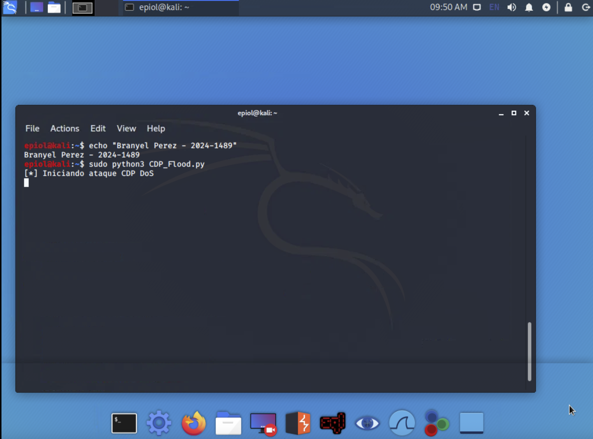
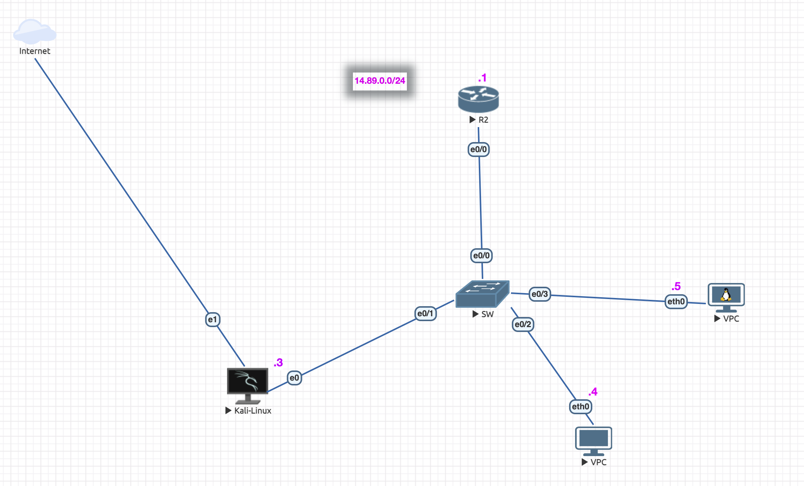

# CDP Neighbor Flooder 🔴

## Ataque de Denegación de Servicio (DoS) contra Infraestructura Cisco

**Autor:** [Branyel Perez](https://www.linkedin.com/in/branyel/)  
**Materia:** Seguridad de Redes con el Prof. Jonathan Rondon

---

## 📋 Descripción

Este script implementa un ataque de **saturación de la tabla de vecinos CDP (Cisco Discovery Protocol)** mediante el envío masivo de paquetes CDP falsificados. El objetivo es demostrar la vulnerabilidad de dispositivos Cisco cuando el protocolo CDP está habilitado sin medidas de seguridad adicionales.

### Objetivo del Ataque

El script envía paquetes CDP con identificadores dinámicos (`HackByEstifenso-XX`) para saturar la memoria del switch víctima, provocando:
- Agotamiento de recursos de memoria
- Denegación de servicio en la tabla de vecinos CDP
- Posible inestabilidad del dispositivo

### Evidencia del Ataque



---

## 🌐 Topología del Laboratorio



**Componentes:**
- **Atacante:** Kali Linux (interfaz `eth0`)
- **Víctima:** Switch Cisco virtualizado en EVE-NG (QEMU)
- **Protocolo:** CDP (Cisco Discovery Protocol)

---

## 🔧 Parámetros Técnicos

| Parámetro | Valor | Descripción |
|-----------|-------|-------------|
| **Dirección MAC Multicast** | `01:00:0c:cc:cc:cc` | Dirección de destino utilizada por CDP |
| **Identificador de dispositivo** | `HackByEstifenso-XX` | Nombre dinámico generado para cada paquete falso |
| **Interfaz de red** | `eth0` | Interfaz de ataque en Kali Linux |
| **Tipo de paquete** | CDP v2 | Versión del protocolo |

---

## 📦 Requisitos

### Software
- Python 3.x
- Scapy (biblioteca de manipulación de paquetes)
- Sistema operativo Linux (preferiblemente Kali Linux)

### Permisos
```bash
# Se requieren permisos de superusuario (root)
sudo python3 CDP_Flood.py
```

### Instalación de dependencias
```bash
pip install -r requirements.txt
```

---

## 🚀 Uso

### Ejecución básica
```bash
sudo python3 CDP_Flood.py
```

### Con parámetros personalizados
```bash
sudo python3 CDP_Flood.py -i eth0 -c 1000
```

**Opciones:**
- `-i, --interface`: Interfaz de red a utilizar (default: eth0)
- `-c, --count`: Número de paquetes a enviar (default: infinito)
- `-d, --delay`: Retraso entre paquetes en segundos (default: 0.1)

---

## ✅ Verificación del Ataque

En el switch Cisco víctima, ejecutar:

```cisco
Switch# show cdp neighbors
```

**Resultado esperado:** Se observará un incremento significativo de entradas falsas con nombres como:
```
Device ID        Local Intrfce     Holdtme    Capability  Platform  Port ID
HackByEstifenso-01  Eth 0/0         180        R S        Linux     eth0
HackByEstifenso-02  Eth 0/0         180        R S        Linux     eth0
HackByEstifenso-03  Eth 0/0         180        R S        Linux     eth0
...
```

Para ver el detalle de la tabla:
```cisco
Switch# show cdp neighbors detail
```

---

## 🛡️ Mitigación

### Deshabilitar CDP globalmente
```cisco
Switch(config)# no cdp run
```

### Deshabilitar CDP en interfaces específicas
```cisco
Switch(config)# interface GigabitEthernet0/1
Switch(config-if)# no cdp enable
```

### Mejores prácticas
1. Deshabilitar CDP en interfaces de usuario/acceso
2. Mantener CDP solo en enlaces troncales autorizados
3. Implementar segmentación de red
4. Monitorear el uso de recursos del dispositivo
5. Considerar el uso de **LLDP** como alternativa más segura

---

## ⚠️ Advertencia Legal

**Este script es únicamente para propósitos educativos y de investigación.**

El uso de esta herramienta contra redes sin autorización explícita es **ilegal** y puede resultar en:
- Cargos criminales
- Responsabilidad civil
- Expulsión académica

**Solo utilizar en entornos de laboratorio controlados.**

---

## 📚 Referencias

- [RFC - Cisco Discovery Protocol](https://tools.ietf.org/html/draft-foschiano-lldp-cdp-00)
- [Scapy Documentation](https://scapy.readthedocs.io/)
- [CISCO CDP Security Best Practices](https://www.cisco.com/c/en/us/support/docs/network-management/discovery-protocol-cdp/118736-technote-cdp-00.html)

---

## 📄 Licencia

Este proyecto está bajo la licencia MIT - ver el archivo [LICENSE](LICENSE) para más detalles.

---

**Universidad:** [Nombre de la Universidad]  
**Fecha:** 2026
